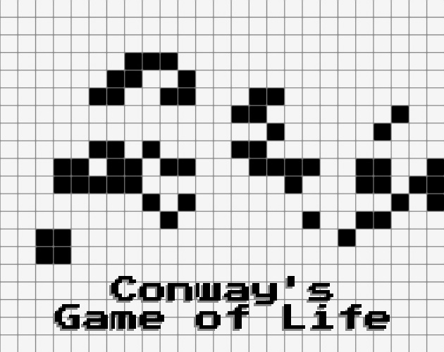
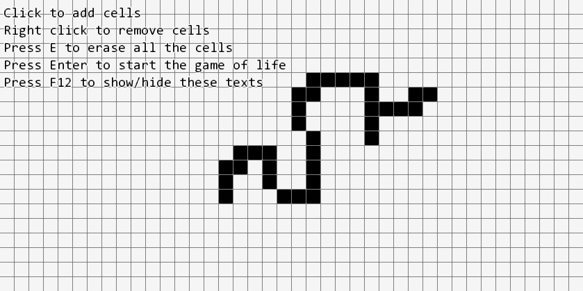
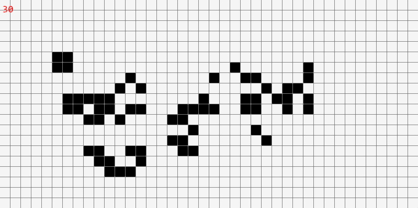

<!--  -->
# Game Of Life
> A 0-player game where you create and see your cellular automaton come alive. Play it on [itch.io](https://yukkichapardev.itch.io/game-of-life).

## General information
I got the idea of coding this game after watching [this video](https://www.youtube.com/watch?v=S-W0NX97DB0). 
Firstly I made the game state to apply the rules, and then I created the editor, so that the player can interact with the game and choose the patterns he wants to draw.

## Setup
You will need to install [GCC 10.3.0](https://winlibs.com/#download-release) as well as [SFML 2.5.1](https://www.sfml-dev.org/download/sfml/2.5.1/index.php).
To compile the project go to the ``bin/`` folder and run the ``make`` command.

## Screenshots

